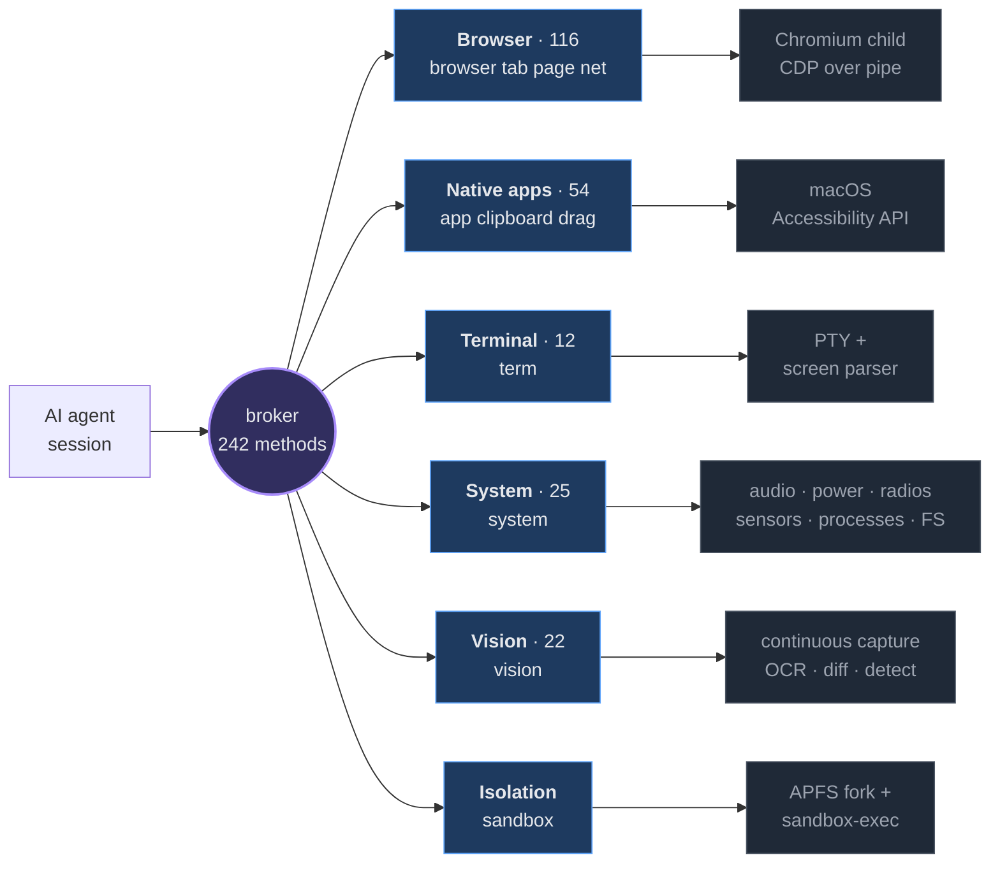
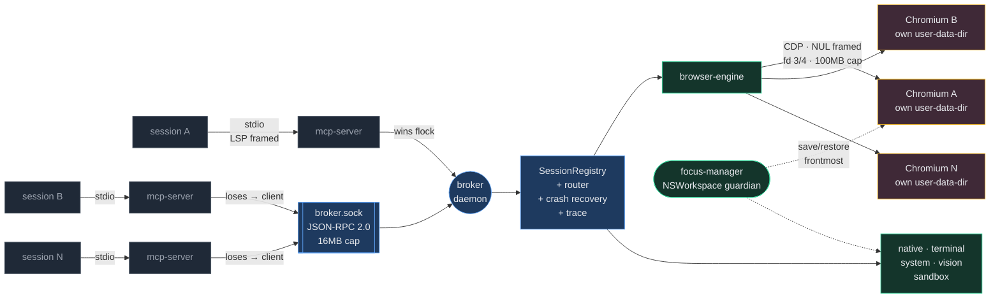
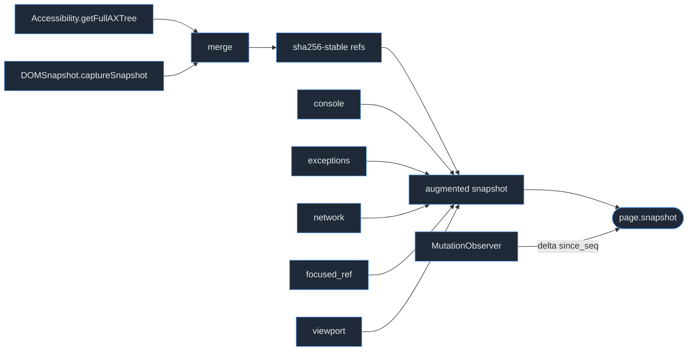

# one-for-all

[](https://github.com/ElijahUmana/one-for-all/actions/workflows/ci.yml)
[](LICENSE)
[](#requirements)
[](https://www.rust-lang.org)

**One control plane for the whole machine.** Browser, native macOS apps, terminals, system hardware, and a continuous vision pipeline — behind a single JSON-RPC surface, driven by any number of AI agent sessions in parallel, with OS-level isolation and zero focus-steal.

```bash
git clone https://github.com/ElijahUmana/one-for-all ~/one-for-all
cd ~/one-for-all
./installer/install.sh
```

Install once. Every agent session in every terminal gets the full surface automatically. No pairing, no browser extension, no per-project configuration.

---

## Six control planes, one protocol

A browser driver sees only the browser. A screenshot loop sees only pixels. A shell sees only the shell. one-for-all puts all of them behind one broker, so an agent filling a web form can also read the Finder window behind it, watch a build log in a PTY, check whether the screen has stopped animating, and fork its own state to try two approaches at once.



The agent never needs to know which plane answers. `page.click`, `app.menu.click`, `term.write`, `system.audio.volume`, and `vision.find_text` are the same shape of call, over the same socket, with the same error contract and the same trace record.

---

## System topology

Every agent session runs its own MCP server. Those servers race for a lock; the winner becomes the broker daemon and the rest become its clients. There is no separate service to start and no port to collide on.



**Three transports, three framings, deliberately.** MCP stdio is LSP-framed (8KB header cap). The broker socket is newline-delimited JSON-RPC 2.0 (16MB cap). CDP is NUL-delimited over `--remote-debugging-pipe` on fd 3/fd 4 (100MB cap) — no port, no localhost firewall prompt, no WebSocket upgrade. Per-target channels are bounded at 1024; backpressure drops oldest and increments a metric rather than ever blocking the CDP reader.

---

## The capability surface

242 RPC methods. Every one is traced, bounded, timeout-wrapped, and returns a typed error rather than a string.

| Family | Methods | What it reaches |
|---|--:|---|
| `page.*` | 94 | Snapshot, input, storage (local/session/IndexedDB/CacheStorage), cookies, coverage, CPU + heap profiling, performance timeline, service workers, web workers, permissions, geolocation, touch and pointer gestures, PDF and print preview, dark mode, paint flashing, viewport and user-agent control |
| `app.*` | 44 | Windows (raise/move/resize/minimize/fullscreen), menus, Dock, Spaces, Spotlight, Notification Center, status menu, Touch Bar, IME and input sources, AppleScript and JavaScript-for-Automation, Automator, keyboard shortcuts, three-finger gestures, force touch |
| `system.*` | 25 | Audio in/out + device selection + capture-to-file, microphone capture, battery, Bluetooth scan/connect, camera snapshot, FSEvents watches, Spotlight metadata queries, network interfaces/routes/connections, process list/info/signal, screen capture + display enumeration, USB device enumeration |
| `vision.*` | 22 | OCR, text search, frame diffing, semantic diff, stability detection, FPS, colour palette, icon recognition, QR and barcode, layout segmentation, region classification, modal/tooltip/loading detection, scrollbar position, animation frames, face blur, action verification |
| `net.*` | 13 | Request interception (fulfill/fail/modify), mocking, replay, HAR export, MITM certificate install, proxy config, WebSocket and EventSource observation and frame injection |
| `term.*` | 12 | PTY spawn, write, read, screen snapshot, scrollback, resize, signals, mouse events, alternate-screen detection, exit watching |
| `clipboard.*` | 8 | Strings, images, file lists, type enumeration, history |
| `tab.*` | 6 | Open, close, focus, list, navigate, wait |
| `browser.*` | 3 | Context create, destroy, list |
| `drag.*` | 2 | Cross-application drag, drag from Finder |

Plus `session.*`, `broker.*`, and `_internal.*` for lifecycle, shutdown, health, and metrics.

---

## Where existing stacks stop

| Stack | Reach | Isolation | Element identity |
|---|---|---|---|
| Playwright | Browser only | Cooperative contexts | Locator re-resolves every action |
| Puppeteer | Browser only | Cooperative contexts | Handles invalidate on navigation |
| chromedp | Browser only | Single target | No AX surfacing |
| Selenium BiDi | Browser only | W3C sessions | No AX-tree primitive |
| browser-use | Browser only | Cooperative | Index shifts on every snapshot |
| browserless | Browser only | Container per session | — |
| Screenshot-and-click loops | Pixels only | None | Coordinates, no identity |
| **one-for-all** | **Browser + native + PTY + system + vision** | **OS-level, process + APFS fork + sandbox-exec** | **sha256-stable refs, explicit `ElementStale`** |

The reach column is the point. Every row above hands an agent one aperture onto the machine and leaves it blind to the rest.

---

## Design decisions

### One Chromium child per session

The requirement "tabs survive session exit" cannot be met by `BrowserContext` plus storage-state restore — that reproduces cookies, not open tabs. Only a real `--user-data-dir` does. So each session gets its own Chromium process.

That choice pays for itself: storage isolation becomes **OS-level rather than cooperative**. Cookies, IndexedDB, CacheStorage, service workers, permissions, downloads, certificate cache, font cache and GPU shader cache cannot cross a process boundary. The cost is ~80MB per session; the default cap of 16 concurrent sessions bounds it at ~1.3GB.

### Element refs that survive layout drift

Page state comes from a merge of `Accessibility.getFullAXTree` and `DOMSnapshot.captureSnapshot`, with sha256-stable element refs that survive layout drift. A ref whose element is gone returns `ElementStale -32004`. It never silently retargets to a different element — the failure mode that makes index-based automation quietly click the wrong thing.



### Zero focus-steal, enforced at compile time

Five independent layers of defence keep a spawning Chromium or a driven native app from taking the frontmost position away from the user, backed by a `NSWorkspace` guardian actor that saves and restores the frontmost application around every focus-risking operation. `clippy::disallowed_methods` is configured to reject every AppKit call that could steal focus outside `focus-manager`, so the boundary is enforced at compile time — and a test asserts no forbidden AppKit symbol appears anywhere else in the workspace.

### Fork the machine, not just the browser

`sandbox` gives each agent session an APFS-cloned profile under `sandbox-exec` confinement, with a retained base snapshot so divergent state can be three-way merged back to the host. Cloning is copy-on-write at the filesystem level, so a multi-gigabyte profile forks in well under a second at near-zero disk cost — which is what makes speculative, parallel agent work practical rather than theoretical.

---

## Workspace layout

```
crates/
├── chromium-fetcher/   CfT manifest, download, verify, extract
├── cdp-client/         NUL-framed pipe transport, codegened CDP bindings
├── ax-engine/          AX + DOM merge, stable refs, MutationObserver deltas
├── focus-manager/      spawn-without-focus-steal, frontmost save/restore
├── browser-engine/     Browser, Page, action dispatch, stealth, emulation
├── native-control/     macOS Accessibility API surface
├── terminal-control/   PTY sessions, output ring, screen parser, scrollback
├── system-control/     audio, battery, bluetooth, camera, fsevents, network,
│                       process, screen, spotlight, usb, permissions
├── vision/             continuous capture, OCR, diffing, detection
├── sandbox/            APFS clone, sandbox-exec profile, three-way merge
├── broker/             socket server, registry, router, recovery, trace
├── mcp-server/         stdio MCP loop, tool dispatch, broker client
├── ofa-cli/            ofa spawn / list / attach / merge / kill / logs
├── observability/      tracing, log dirs, metrics, channel caps
└── bench/              latency SLO gates
docs/                   ARCHITECTURE · PROTOCOL · QUICKSTART
installer/              install · uninstall · doctor · e2e smoke · launchd plist
tools/                  ofa-status · ofa-tail · ofa-trace · ofa-replay · lint-sh
```

---

## Engineering standard

These are enforced in the codebase, not aspirations:

- No `.unwrap()` or `.expect()` outside test code.
- Every `pub` item carries a `///` doc comment.
- Every async `pub fn` carries a `// CANCELLATION:` note describing its cancel-safety.
- Every external I/O call is wrapped in `tokio::time::timeout`.
- Every channel is bounded; backpressure is explicit and metered.
- Every `tokio::spawn` handle is stored and wired into shutdown.
- No string-typed errors — `thiserror` enums only.
- Exact pinned dependency versions across the workspace.
- `clippy::disallowed_methods` covers every focus-steal API.

**465 tests pass** across the workspace. Latency SLOs are asserted by benchmarks in `crates/bench` rather than assumed.

---

## Requirements

- macOS 13+
- Rust 1.78+ (pinned via workspace `rust-version`)
- `jq`, `python3`, `plutil`, `launchctl` — all verified by `installer/doctor.sh`
- ~200MB disk for the pinned Chromium-for-Testing build
- ~80MB RAM per concurrent session

## Verifying an install

```bash
./installer/doctor.sh      # paths, permissions, plist, config drift
./installer/e2e-smoke.sh   # full broker + MCP + Chromium round-trip
```

Both exit 0 on a healthy install. `docs/QUICKSTART.md` has the triage path when they don't.

## Documentation

- [`docs/QUICKSTART.md`](docs/QUICKSTART.md) — install, first call, the agent loop shape
- [`docs/PROTOCOL.md`](docs/PROTOCOL.md) — wire format, framing, round-trips, error codes, event topics
- [`docs/ARCHITECTURE.md`](docs/ARCHITECTURE.md) — components, threading, focus discipline, snapshot algorithm, recovery, drop order

## License

MIT — see [`LICENSE`](LICENSE).
