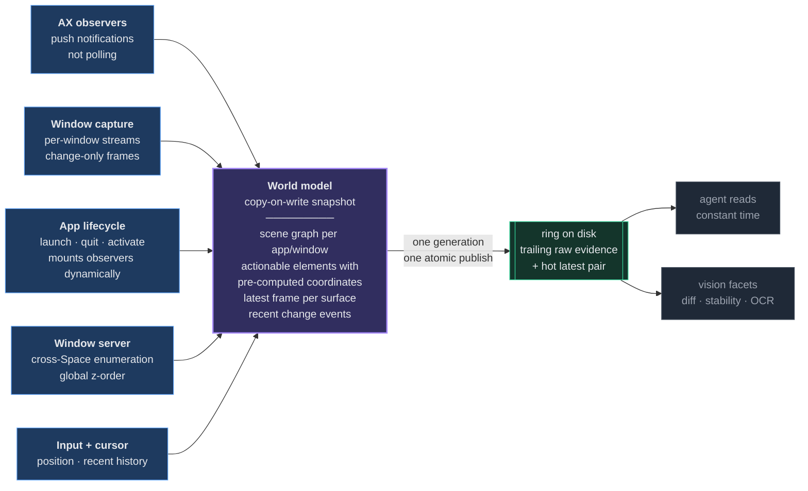
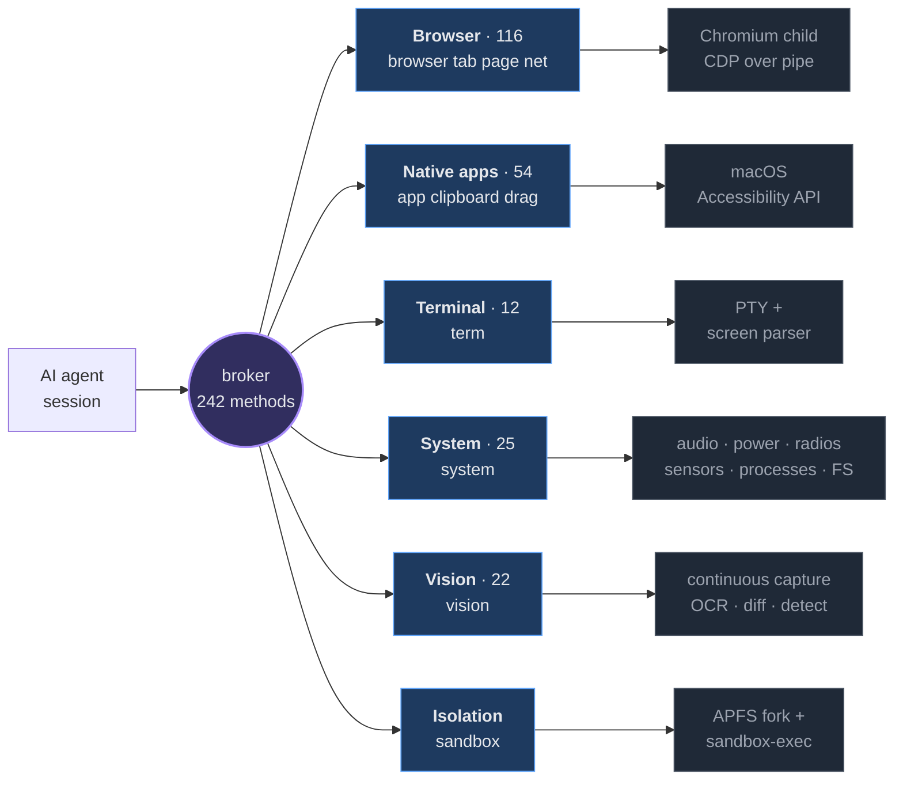
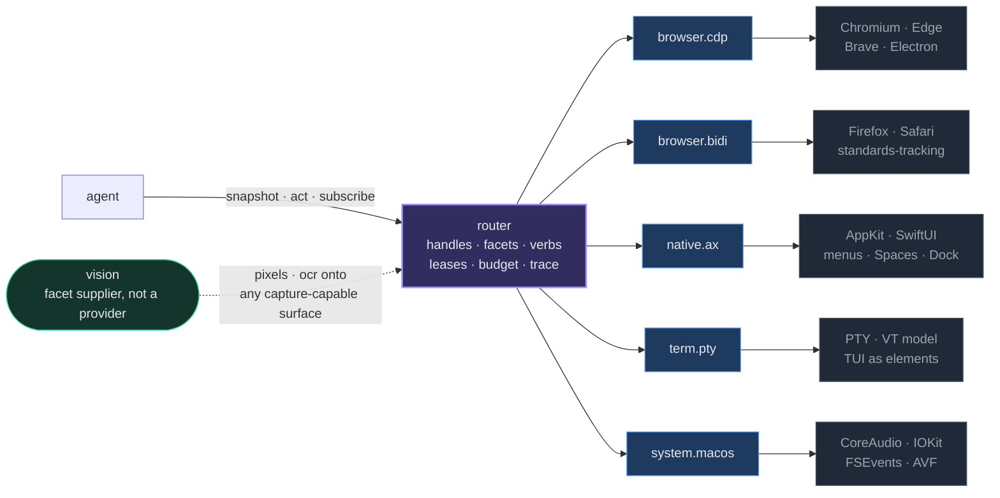

# one-for-all

[](https://github.com/ElijahUmana/one-for-all/actions/workflows/ci.yml)
[](LICENSE)
[](#requirements)
[](https://www.rust-lang.org)

**One control plane for the whole machine.** Browser, native macOS apps, terminals, system hardware, and a continuous vision pipeline — behind a single JSON-RPC surface, driven by any number of AI agent sessions in parallel, with OS-level isolation and zero focus-steal.

```bash
git clone https://github.com/ElijahUmana/one-for-all ~/one-for-all
cd ~/one-for-all
./installer/install.sh
```

Install once. Every agent session in every terminal gets the full surface automatically. No pairing, no browser extension, no per-project configuration.

---

## Continuous perception

**This is the primitive everything else is built on.** Every other computer-use stack re-derives the world before each action:

```
list apps → list windows → walk the accessibility tree → screenshot
          → guess coordinates → click → screenshot → re-reason → repeat
```

That loop is paid *per action*, and between actions the model is blind. Walking an accessibility tree is not cheap and its cost is not a function of node count — it is set by how fast the **target application's** run loop services requests, which is why a heavy app can take seconds to enumerate while a light one takes tens of milliseconds. Putting that walk on the critical path of every click is what makes conventional agents slow and, worse, stale.

So perception here is **not a probe**. Five streams run continuously, in parallel, and never block each other; they are fused into one always-current world model that is published atomically and read in constant time.



The agent never pays for a walk. It reads a model that is already current.

**Why this is what makes vision continuous.** Because structure and pixels are captured under *one generation and one atomic publish point*, vision stops being a separate screenshot the agent has to request and becomes a **facet of the same observation** the scene graph came from. That is the difference between a screenshot tool and a perception layer, and it is what makes the vision surface meaningful at all — `vision.stability`, `vision.compare`, `vision.loading.detect`, `vision.find_text`, `vision.diff.semantic` are reads against a stream that is already running, correlated with the elements in the same frame. Ask whether the screen has settled and the answer comes from a diff that was already computed, not from two screenshots taken on demand and hoped to be comparable.

That coupling is also a hard contract, not a convention:

| Coherence | Meaning |
|---|---|
| **Coherent** | Frame and structure captured within a bounded skew. Element refs align with pixels. |
| **Skewed** | Structure is stale by a stated amount — **and the agent is told the number** |
| **Degraded** | Pixels only, with the reason |

An agent told "structure is 400 ms stale" behaves correctly. An agent handed a silent empty tree concludes the screen is blank and acts on it. Publishing is atomic — write to a temp path, `rename()` into place — so a reader never observes a half-written world, and the ring keeps the trailing raw history as evidence while the latest pair stays the hot read.

**A perception layer, not an intent layer.** The model is handed everything — every element, every coordinate, the current frame, the recent changes — and does its own reasoning. There is no "click the Submit button" semantic shortcut interpreting on its behalf. The verbs stay primitive and the model supplies every parameter from what it sees.

---

## Six control planes, one protocol

A browser driver sees only the browser. A screenshot loop sees only pixels. A shell sees only the shell. one-for-all puts all of them behind one broker, so an agent filling a web form can also read the Finder window behind it, watch a build log in a PTY, check whether the screen has stopped animating, and fork its own state to try two approaches at once.



The agent never needs to know which plane answers. `page.click`, `app.menu.click`, `term.write`, `system.audio.volume`, and `vision.find_text` are the same shape of call, over the same socket, with the same error contract and the same trace record.

---

## System topology

Every agent session runs its own MCP server. Those servers race for a lock; the winner becomes the broker daemon and the rest become its clients. There is no separate service to start and no port to collide on.


**Three transports, three framings, deliberately.** MCP stdio is LSP-framed (8KB header cap). The broker socket is newline-delimited JSON-RPC 2.0 (16MB cap). CDP is NUL-delimited over `--remote-debugging-pipe` on fd 3/fd 4 (100MB cap) — no port, no localhost firewall prompt, no WebSocket upgrade. Per-target channels are bounded at 1024; backpressure drops oldest and increments a metric rather than ever blocking the CDP reader.

---

## The capability surface

**242 methods routed by the broker; 165 currently exposed over MCP.** Every one is traced, bounded, timeout-wrapped, and returns a typed error rather than a string.

The gap is real and worth naming: 64 agent-facing methods — 38 `app.*`, 13 `page.*`, 8 `clipboard.*`, plus `term`, `drag` and `system` entries — are fully routed by the broker and reachable over the raw socket, but are not yet published in the MCP tool list. The remaining 13 are lifecycle and event topics that are not tools by design.

| Family | Methods | What it reaches |
|---|--:|---|
| `page.*` | 94 | Snapshot, input, storage (local/session/IndexedDB/CacheStorage), cookies, coverage, CPU + heap profiling, performance timeline, service workers, web workers, permissions, geolocation, touch and pointer gestures, PDF and print preview, dark mode, paint flashing, viewport and user-agent control |
| `app.*` | 44 | Windows (raise/move/resize/minimize/fullscreen), menus, Dock, Spaces, Spotlight, Notification Center, status menu, Touch Bar, IME and input sources, AppleScript and JavaScript-for-Automation, Automator, keyboard shortcuts, three-finger gestures, force touch |
| `system.*` | 25 | Audio in/out + device selection + capture-to-file, microphone capture, battery, Bluetooth scan/connect, camera snapshot, FSEvents watches, Spotlight metadata queries, network interfaces/routes/connections, process list/info/signal, screen capture + display enumeration, USB device enumeration |
| `vision.*` | 22 | OCR, text search, frame diffing, semantic diff, stability detection, FPS, colour palette, icon recognition, QR and barcode, layout segmentation, region classification, modal/tooltip/loading detection, scrollbar position, animation frames, face blur, action verification |
| `net.*` | 13 | Request interception (fulfill/fail/modify), mocking, replay, HAR export, MITM certificate install, proxy config, WebSocket and EventSource observation and frame injection |
| `term.*` | 12 | PTY spawn, write, read, screen snapshot, scrollback, resize, signals, mouse events, alternate-screen detection, exit watching |
| `clipboard.*` | 8 | Strings, images, file lists, type enumeration, history |
| `tab.*` | 6 | Open, close, focus, list, navigate, wait |
| `browser.*` | 3 | Context create, destroy, list |
| `drag.*` | 2 | Cross-application drag, drag from Finder |

Plus `session.*`, `broker.*`, and `_internal.*` for lifecycle, shutdown, health, and metrics.

### The sub-granularity that usually gets skipped

The families above are the headline. This is the part the mandate was actually written for — each row is a place other stacks stop and hand you an escape hatch.

| | Surface | What it covers |
|---|---|---|
| **U1** | Browser deep input | Multi-touch tap/swipe/pinch/rotate, pointer events with pressure and tilt, file drop *into* a page via `synthesizeDragEvent`, IME composition for CJK, dead keys, velocity-controlled precise scroll, tab-order traversal, right-click menu navigation |
| **U2** | Browser deep state | IndexedDB list/query/put/delete, CacheStorage, service workers, web workers, deep cookie set, local/sessionStorage with compare-and-swap, permission grant/revoke/query, storage quota |
| **U3** | Browser deep network | Fulfil, modify or fail a request in flight, XHR replay, WebSocket observe *and* frame injection, EventSource observe, HAR export, proxy config, MITM cert install into the per-session trust store |
| **U4** | Performance + introspection | Tracing timeline, `Performance.getMetrics`, JS and CSS precise coverage, heap snapshot and allocation sampling, CPU profile, layout metrics, paint-rect flashing |
| **U5** | Print | Full `printToPDF` option surface, print-media preview |
| **U6** | Native macOS depth | Menu bar, status menu, Notification Center, Spotlight, Spaces, Dock, window geometry, Touch Bar, three-finger swipe, force touch with pressure, input-source switching, Shortcuts, Automator, AppleScript, JXA, QuickLook |
| **U7** | Clipboard + cross-app drag | Strings, files, images, type enumeration, change-count-backed history, drag from Finder, drag between apps |
| **U8** | System devices | CoreAudio in/out/select/volume/mute/capture, mic capture, camera snapshot, region screen capture, Bluetooth scan/connect, USB enumeration, battery, network interfaces/routes/live connections, process list/info/signal, FSEvents watches, Spotlight and `mdls` metadata |
| **U9** | Terminal / PTY | Real PTY — not a bash subshell. `vte`-parsed screen with cursor and attributes, scrollback ring, resize, signals, alternate-screen detection, xterm mouse-sequence injection |
| **U10** | Vision sub-granularity | Single-pixel RGBA off the frame ring, region classification, colour palette, text style, layout segmentation, icon recognition, QR/barcode, scrollbar position, loading/spinner detection, tooltip and modal detection, semantic diff as no-op/progress/failure/success, animation frame capture, face blur |

U1 through U10 are dispatched by the broker today. Two specified surfaces are not yet wired:

| | Surface | Status |
|---|---|---|
| **U11** | Atomicity + conditionals — `action.batch` (atomic, stop-on-error), `if_then` over predicates, `retry_until` with backoff, scheduled `action.at`, exclusive `lock_focus` | Specified, not yet dispatched |
| **U12** | Nested agents — spawn a sub-agent session, observe its trace, hand off a session, merge its diverged state back | Specified, not yet dispatched. The merge primitive it builds on exists in `sandbox` |

Cross-cutting (**U13**): every call emits a trace event when `trace: true`; clipboard reads return `{redacted: true}` against user redact patterns; first use of a permission-gated device prompts; every PTY session inherits the session sandbox policy; native control respects a per-session `app_blocklist`; face detection is consent-gated behind an explicit capability.

---

## Performance

The bench suite asserts hard SLOs and fails the build rather than reporting a regression quietly. `scripts/ci-bench-gate.sh` surfaces a tracked WARN when a gate is skipped — there is no silent skip.

| Benchmark | Gate |
|---|---|
| `cdp_request_per_sec` | ≥ 10,000 req/s |
| `vision_find_text_p99` | ≤ 10 ms |
| `frame_capture_to_event_p99` | ≤ 50 ms |
| `page_click_p99` | ≤ 100 ms (end-to-end, real Chromium) |
| `sandbox_spawn_p99` | ≤ 3 s |

The design target behind those numbers: an agent should never pay a perception tax. Conventional computer-use loops re-derive the world before every action — enumerate apps, walk the accessibility tree, screenshot, guess coordinates — costing hundreds of milliseconds per click and leaving the model with no continuous awareness between actions. Here the state is already computed and already on the table when the model reads it.

---

## Where existing stacks stop

| Stack | Reach | Isolation | Element identity |
|---|---|---|---|
| Playwright | Browser only | Cooperative contexts | Locator re-resolves every action |
| Puppeteer | Browser only | Cooperative contexts | Handles invalidate on navigation |
| chromedp | Browser only | Single target | No AX surfacing |
| Selenium BiDi | Browser only | W3C sessions | No AX-tree primitive |
| browser-use | Browser only | Cooperative | Index shifts on every snapshot |
| browserless | Browser only | Container per session | — |
| Screenshot-and-click loops | Pixels only | None | Coordinates, no identity |
| **one-for-all** | **Browser + native + PTY + system + vision** | **OS-level, process + APFS fork + sandbox-exec** | **sha256-stable refs, explicit `ElementStale`** |

The reach column is the point. Every row above hands an agent one aperture onto the machine and leaves it blind to the rest.

---

## Design decisions

### One Chromium child per session

The requirement "tabs survive session exit" cannot be met by `BrowserContext` plus storage-state restore — that reproduces cookies, not open tabs. Only a real `--user-data-dir` does. So each session gets its own Chromium process.

That choice pays for itself: storage isolation becomes **OS-level rather than cooperative**. Cookies, IndexedDB, CacheStorage, service workers, permissions, downloads, certificate cache, font cache and GPU shader cache cannot cross a process boundary. The cost is ~80MB per session; the default cap of 16 concurrent sessions bounds it at ~1.3GB.

### Element refs that survive layout drift

Page state comes from a merge of `Accessibility.getFullAXTree` and `DOMSnapshot.captureSnapshot`, with sha256-stable element refs that survive layout drift. A ref whose element is gone returns `ElementStale -32004`. It never silently retargets to a different element — the failure mode that makes index-based automation quietly click the wrong thing.


### Zero focus-steal, enforced at compile time

Five independent layers of defence keep a spawning Chromium or a driven native app from taking the frontmost position away from the user, backed by a `NSWorkspace` guardian actor that saves and restores the frontmost application around every focus-risking operation. `clippy::disallowed_methods` is configured to reject every AppKit call that could steal focus outside `focus-manager`, so the boundary is enforced at compile time — and a test asserts no forbidden AppKit symbol appears anywhere else in the workspace.

### Nothing is lost silently

The failure mode this system is built hardest against is not an error — it is a plausible-looking empty result. An agent handed `[]` concludes the screen is empty and acts on that. An agent told *"structure is 400 ms stale"* behaves correctly. So every path that can lose information is required to say so:

| Path | Guarantee |
|---|---|
| A capture that could not be taken | Reported as an explicit skip with a reason, never omitted from the payload |
| A bounded channel dropping under backpressure | Drop is counted at the producer **and** surfaced on the next delivered item, so a consumer never silently misses events |
| A capability that is unavailable | Exactly three answers — supported, unsupported with a reason, or degraded with a remedy. There is no fourth state and no silence |
| A handle whose surface died | Returns an explicit gone-since marker, never an empty success |
| A frame ring consumer falling behind | Emits an explicit gap count and resynchronises; a gap is reported, never hidden |
| An AX walk hitting its depth or node ceiling | Sets `truncated_at` to `"depth"` or `"nodes"` and warns — no silent truncation |
| A snapshot mixing sources | Image and structure carry the same generation and describe one atomic publish point. Facets that could not be captured at that instant are marked skipped, never stitched in from a different moment |

The same rule governs the on-disk contract: every tick writes to a temp path and `rename()`s into place, atomic on APFS, so a reader never observes a partial write — and the ring retains the trailing raw evidence for any consumer that needs to look back, while the latest pair stays the hot read. Truncation in the hot payload is a *deferral*, not a deletion.

### Fork the machine, not just the browser

`sandbox` gives each agent session an APFS-cloned profile under `sandbox-exec` confinement, with a retained base snapshot so divergent state can be three-way merged back to the host. Cloning is copy-on-write at the filesystem level, so a multi-gigabyte profile forks in well under a second at near-zero disk cost — which is what makes speculative, parallel agent work practical rather than theoretical.

---

## Where this is going: one contract, real depth

242 flat methods across disjoint namespaces is the honest cost of covering everything. `page.click`, `app.click` and `term.mouse_event` are three universes that do the same thing. The next architecture collapses them without amputating any of the depth that made them separate.

**The unification is not "everything is an element."** A cookie is not an element. A PTY cell is not a widget. A Bluetooth device is not clickable. Forcing them into one shape is how you lose depth — which is the exact failure the coverage mandate exists to prevent.

Instead the contract unifies at five seams, and only five:

| Seam | Design |
|---|---|
| **Addressing** | One URI-shaped handle namespace every provider mints and resolves — `glance://browser.cdp@sess-A/ctx-7/tab-3/frame-F12A9C`, `glance://term.pty@local/s-9`, `glance://system.macos@local/audio/output/…` |
| **Perception** | A surface graph plus per-surface **facets**: typed, provider-declared, individually negotiated state bundles. `elements` is *one* facet. `cookies` is a facet. `grid` is a facet. `devices` is a facet |
| **Action** | A small closed verb set every provider maps into, plus a schema-carrying `Op` escape hatch so no native capability is amputated by the abstraction |
| **Observation** | One hierarchical topic namespace rooted at the handle, with a universal `state.changed` invalidation signal |
| **Identity** | A three-tier `Handle` / `Ref` / `Anchor` split with an explicit resolution ladder — and a low-confidence match is never silently used, it returns ranked candidates instead |

Facets are the load-bearing invention: the contract stays uniform, the *content* stays surface-native, and the agent negotiates which native truth it wants.



Three consequences worth stating outright:

- **Perception is a read against a continuously maintained world model, not a synchronous probe.** Walking an accessibility tree on every perception tick does not scale — walk cost is set by how fast the *target application's* run loop services requests, not by node count. Synchronous probes are the fallback, not the default.
- **Vision is a facet supplier, not a peer provider.** Making it a provider forces the agent to correlate two addressing schemes for the same pixels.
- **The unit of parallelism is the target application, not the machine.** Accessibility calls are direct IPC to the target process, so N agents driving N different apps run genuinely concurrently at zero focus cost. That single fact is what makes the whole parallel model work, and it is why contention is arbitrated per app rather than globally.

Safari is the design's own hardest test and the strongest validation of the multi-provider model: its BiDi implementation has no input module at all, so a surface can *find* an element and cannot *click* it. The answer is a composite surface — standards-based navigation and storage from one provider, elements and every verb from the native accessibility provider, composed onto one handle with the split declared in the capability set.

---

## Workspace layout

```
crates/
├── chromium-fetcher/   CfT manifest, download, verify, extract
├── cdp-client/         NUL-framed pipe transport, codegened CDP bindings
├── ax-engine/          AX + DOM merge, stable refs, MutationObserver deltas
├── focus-manager/      spawn-without-focus-steal, frontmost save/restore
├── browser-engine/     Browser, Page, action dispatch, stealth, emulation
├── native-control/     macOS Accessibility API surface
├── terminal-control/   PTY sessions, output ring, screen parser, scrollback
├── system-control/     audio, battery, bluetooth, camera, fsevents, network,
│                       process, screen, spotlight, usb, permissions
├── vision/             continuous capture, OCR, diffing, detection
├── sandbox/            APFS clone, sandbox-exec profile, three-way merge
├── broker/             socket server, registry, router, recovery, trace
├── mcp-server/         stdio MCP loop, tool dispatch, broker client
├── ofa-cli/            ofa spawn / list / attach / merge / kill / logs
├── observability/      tracing, log dirs, metrics, channel caps
└── bench/              latency SLO gates
docs/                   ARCHITECTURE · PROTOCOL · QUICKSTART
installer/              install · uninstall · doctor · e2e smoke · launchd plist
tools/                  ofa-status · ofa-tail · ofa-trace · ofa-replay · lint-sh
```

---

## Engineering standard

These are enforced in the codebase, not aspirations:

- No `.unwrap()` or `.expect()` outside test code.
- Every `pub` item carries a `///` doc comment.
- Every async `pub fn` carries a `// CANCELLATION:` note describing its cancel-safety.
- Every external I/O call is wrapped in `tokio::time::timeout`.
- Every channel is bounded; backpressure is explicit and metered.
- Every `tokio::spawn` handle is stored and wired into shutdown.
- No string-typed errors — `thiserror` enums only.
- Exact pinned dependency versions across the workspace.
- `clippy::disallowed_methods` covers every focus-steal API.

**465 tests pass** across the workspace. Latency SLOs are asserted by benchmarks in `crates/bench` rather than assumed.

---

## Requirements

- macOS 13+
- Rust 1.78+ (pinned via workspace `rust-version`)
- `jq`, `python3`, `plutil`, `launchctl` — all verified by `installer/doctor.sh`
- ~200MB disk for the pinned Chromium-for-Testing build
- ~80MB RAM per concurrent session

## Verifying an install

```bash
./installer/doctor.sh      # paths, permissions, plist, config drift
./installer/e2e-smoke.sh   # full broker + MCP + Chromium round-trip
```

Both exit 0 on a healthy install. `docs/QUICKSTART.md` has the triage path when they don't.

## Documentation

- [`docs/QUICKSTART.md`](docs/QUICKSTART.md) — install, first call, the agent loop shape
- [`docs/PROTOCOL.md`](docs/PROTOCOL.md) — wire format, framing, round-trips, error codes, event topics
- [`docs/ARCHITECTURE.md`](docs/ARCHITECTURE.md) — components, threading, focus discipline, snapshot algorithm, recovery, drop order

## License

MIT — see [`LICENSE`](LICENSE).
